# Cinema3000: A Movie Theater Booking Website
## Pei Lin Chen -  Taipei, Taiwan

<!-- #### Video DemoL <URL:> -->

## Description
A webpage where user can browse theaters information, view movie show times, and book tickets for their preferred show times.

This webpage is built with python, html, css, and sqlite3 to power the page.
<br>
Additionally, it used Flask framework, Flask-SQLAlchemy dealing with database, Flask-login, and Jinja syntax to function.
<br>
Bootstrap 5 is used in the html.

# Setup & Installation
To run the website on your local machine, follow these steps:

### Install the required dependencies: 
1. Make sure you have the latest version of python installed.
2. Navigate your way to where the project folder is and make sure you're in the folder where main.py is.


3. Run this command in the terminal not Python environment.
```
pip install -r requirements.txt
```
This will install all necessary python package to run this program.

### Start the server: 

In terminal type: 
```
export FLASK_APP=main
```
Then type: 
```
flask run
```

### Usage:

Once the server is running, you can access the website at http://127.0.0.1:5000. 
<br>
Or you could just press the url that showed up in the prompt when you run the program in the terminal.

# Features

Cinema3000 offers the following features:

## Register
User can register through the register page.
<br>
After successfully logging in, the database will record the new user and update the user.csv file.
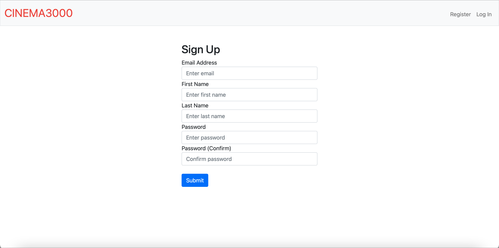

## Log In
Check if the user email is in the database or not. Then verify the password.
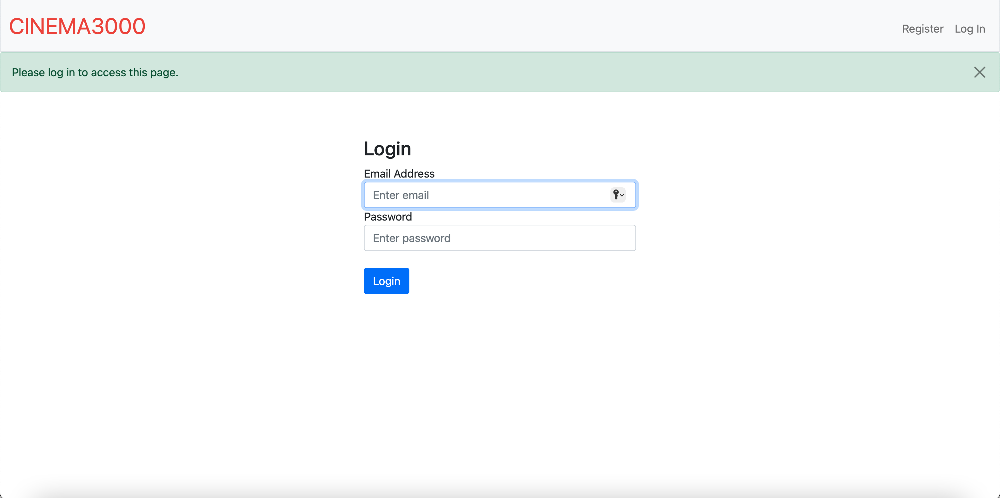

## Log Out
After logging out, the page will redirect to login page.


## Testing Account
The database contains existing accounts. Here are a list of them if you wish to log in using them.
More information except for passwords can be found in `user.csv`.
| Email                | Password | First Name |
|----------------------|----------|------------|
| blackbeard@gmail.com | 12345678 | Edward     |
| gentleman@gmail.com  | 12345678 | Stede      |
| nathanfoad@gmail.com | 12345678 | Lucius     |
| daughter@gmail.com   | 12345678 | Alma       |
| nathanfoad@gmail.com | 12345678 | Lucius     |
| cs50@gmail.com       | 12345678 | John       |

Of course you can also register a new account.

## Home
The home page users can redirect themselves to [Theater Page](#theater), [Current Movies Page](#current-movies), or [My Bookings Page](#my-bookings) by clicking buttons or using navigation tab.
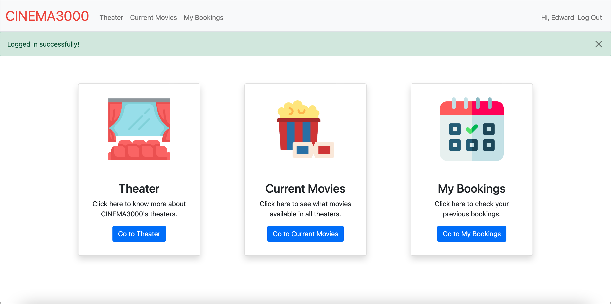

## Theater
- Browse theaters: 
User can browse through theater characteristics, including name, number of seats, as well as current movies available for each theater.
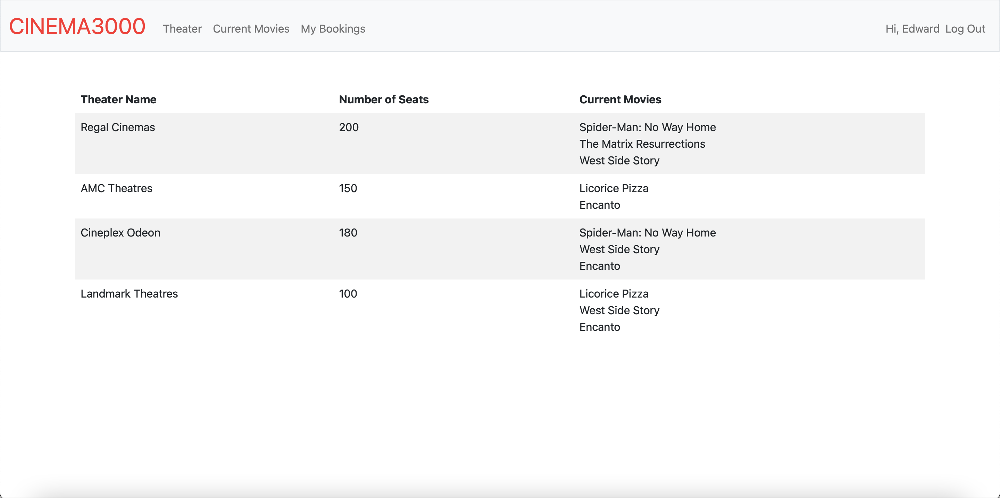

## Current Movies
- Search movie show times and book tickets: 
  * Search show times:
    1. Select the desired date user wish to watch movies and click "Search" button.
    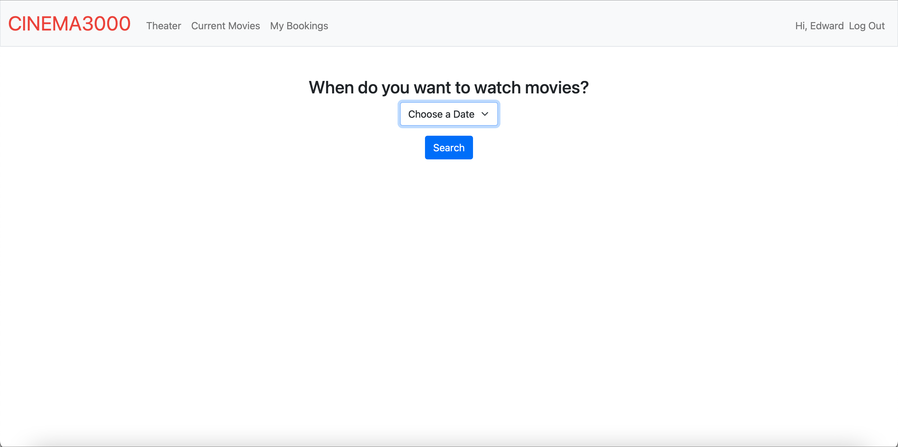
    2. Then users can view show times for all movies and theaters on the specific day with "Book" button on the right side of each show time.
    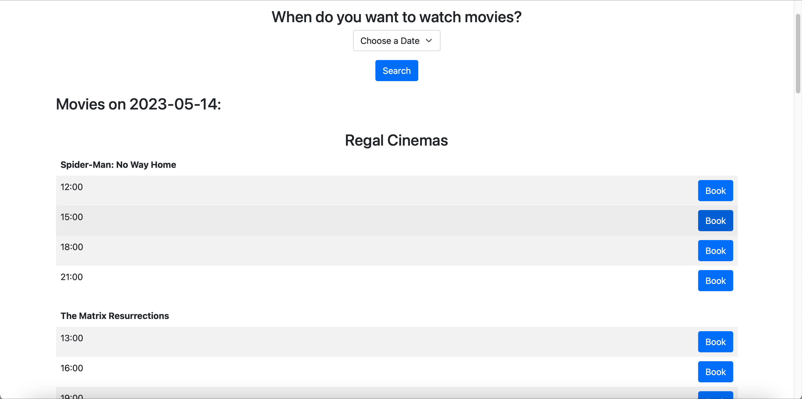
  * Book tickets: 
    1. Click "Book" button of user's preferred show times. 
    2. Afterward, user will be redirected to another page to select a desired number of tickets. Click "Buy Ticket" after choosing the number.
    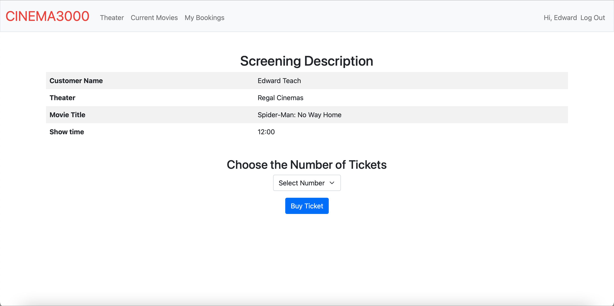
    3. Finally, if tickets are successfully booked, the page will redirect to [My Bookings Page](#my-bookings). If there is no ticket left for desired booking, user will be redirect to [Current Movies Page](#current-movies).
  * Special features
    1. If there's not enough ticket, the page will reject the transaction and show warning message.
    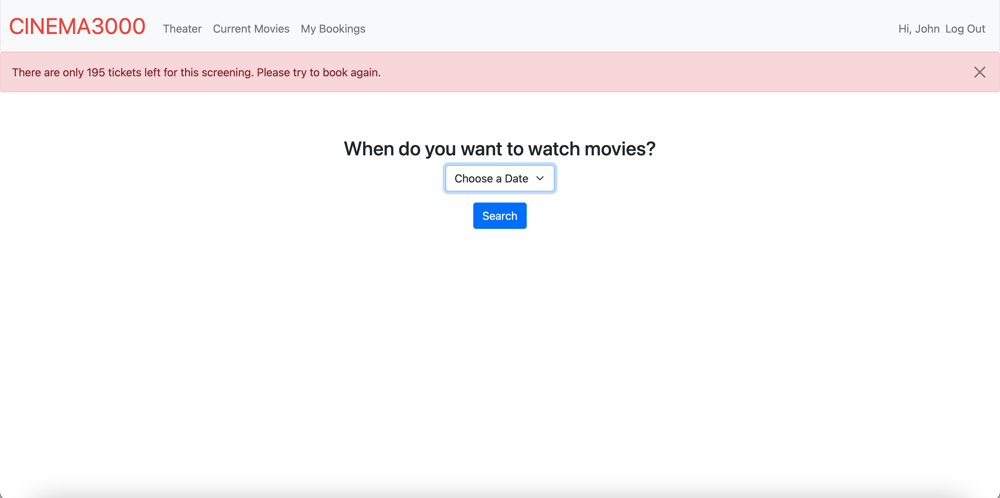
    2. If a screening is sold out, the user cannot buy the ticket and the system will show.
    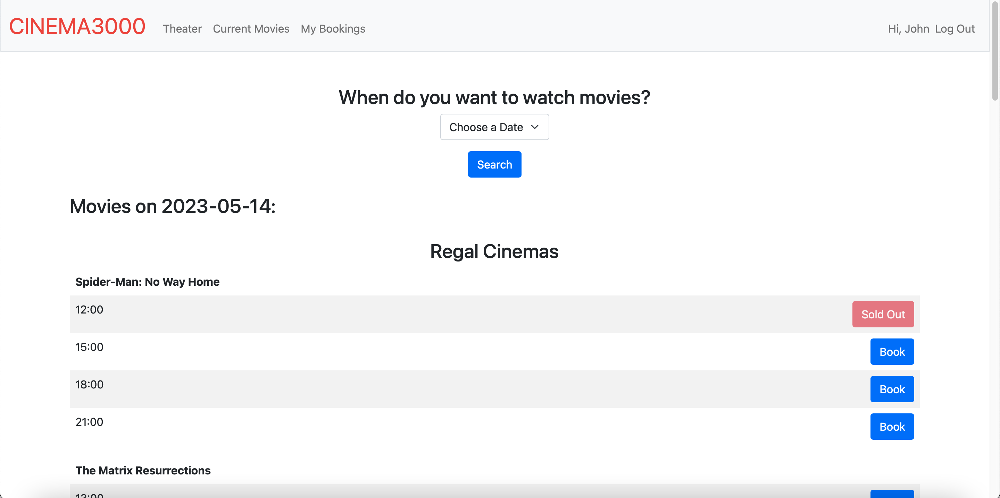
  

## My Bookings
- Check booking history: Users can check their booking history, accessing booking information.
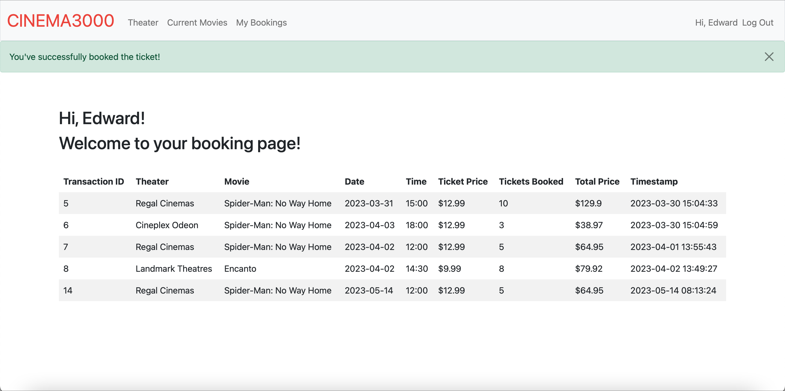

# Project Structure
```
Cinema3000
├── website
│   ├── instance
│   │   └── database.db
│   ├── static
│   │   ├── user.csv
│   │   ├── theater.csv
│   │   ├── movie.csv
│   │   ├── booking.csv
│   │   ├── screening.csv
│   │   ├── styles.css
│   │   └── image
│   │       ├── booking.png
│   │       ├── movie.png
│   │       └── movie-theater.png
│   ├── templates
│   │   ├── layout.html
│   │   ├── register.html
│   │   ├── login.html
│   │   ├── home.html
│   │   ├── theater.html
│   │   ├── movies.html
│   │   ├── ticket.html
│   │   └── booking.html
│   ├── __init__.py
│   ├── auth.py
│   ├── models.py
│   └──  views.py
├── main.py
├── requirements.txt
├── README.md
├── database.dbml
└── LICENSE.txt
```
## Files Explanation
`Cinema3000`: The name of the project.

`website`: A directory contains all the code and files related to the web application.

`instance`: A directory contains a SQLite database.

`static`: This directory contains all the static files used by the web application, including CSS stylesheets, images, and CSV files.

`templates`: This directory contains all the HTML templates used to render the web pages of the application.

`__init__.py`: a special file that makes the `website` directory a python package.

`auth.py`: A file contains code for user authentication and registration.

`models.py`: A file contains code for defining and interacting with the database models.

`views.py`: A file contains the application logic for handling requests and rendering templates.

`main.py`: The main Python script that starts the web server and runs the application.

`requirements.txt`: A file lists all the Python packages required by the application.

`README.md`: The file contains information on how to set up, run the application, web application features, and more.

`database.dbml`: This file is a database model diagram that shows the relationships between the database tables.

`LICENSE.txt`: This file contains the license under which the project is released.

# Database Relationship
This picture shows table relationship in the `database.db`.

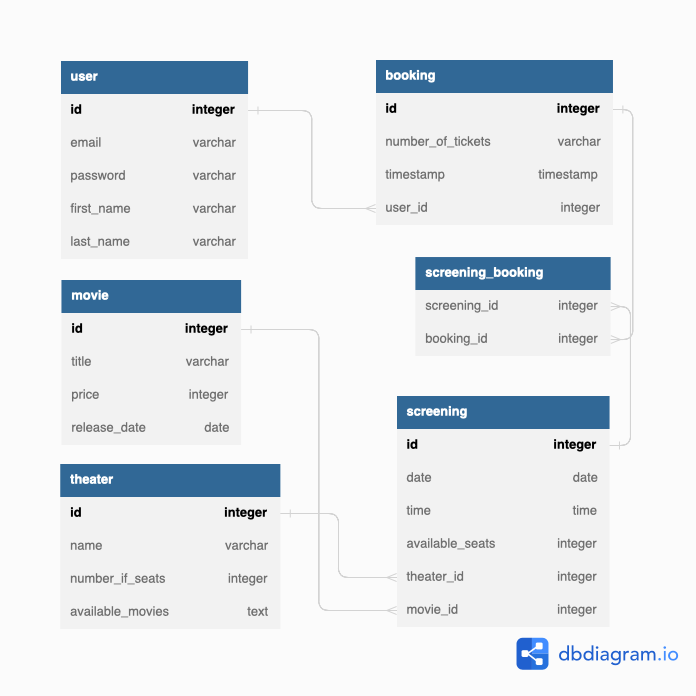


# License
This project is licensed under the MIT License - see the LICENSE file for details.

# Resource
The methods my code used is inspired by the flask tutorials by [Tech with Tim](https://youtu.be/dam0GPOAvVI) and Flask SQLAlchemy tutorials by [Pretty Printed](https://youtu.be/SYG1jQYIxfQ)

#### PNGs used are downloaded from [flaticon.com](https://www.flaticon.com)
- https://www.flaticon.com/free-icon/movie_2798024?related_id=2798007&origin=search
- https://www.flaticon.com/free-icon/booking_2460875
- https://www.flaticon.com/free-icon/movie-theater_3946014?related_id=3946005&origin=search